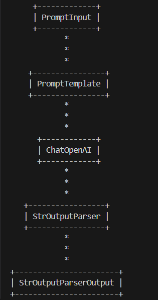
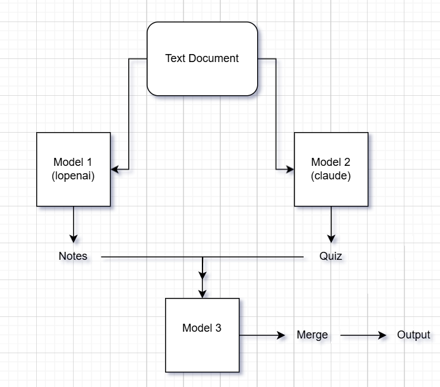

Chains
=========
-can create pipeline for small steps in LLMs by connecting them and forming pipeline.
-1st step output is input for next step and so On.
-to give input to only 1st step and trigger pipeline.
-can create different structured pipelines like Linear/sequential pipeline, Parallel processing, conditional chains etc.
- | : is pipe operatorand the process of using it to add components is called LCEL (langchain expression language)
-can visualize chains by printing it using funtion get_graph().print_ascii() [install grandalf]

**Sequential Chain**
-Get topic from user>send to llm with a prompt to get detailed report on that topic, llm will process and give > report > again send this detailed report to llm and >2nd prompt to get 5 most impt points from the report(summarize)>summary

**Parallel Chain**
-User will provide text(detailed text/document on a topic)a document>generate notes and quiz from this document > combine them and give to user.
-Parallel chains : *Usecase*

-to make parallel chain we need RunnableParallel

**Conditional Chains**
-User will give feedback>analyze (sentiment: +/-)>if sentiment + (give thank u and feedback form) otherwise sorry for inconvinience and send email to customer support : as agents
-here not using agents so will be simple not feedback form and custmer support 
-branch chain using runnablebranch>sending multiple tuples >pass condition and which chain to execute for true condition
-runnablebranch : for branching
branch_chain = RunnableBranch(
    (condition1, chain1),
    (condition2, chain2),
    default chain
)
-RunnableLambda : converts lambda function to runnable so that it can be used as a chain
