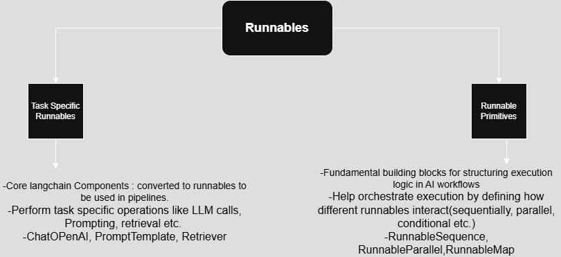

Runnables
=========

**why Exist ?**
-allow chaining different operations (like prompts, models, and parsers) seamlessly while handling parallel execution, streaming, and async processing efficiently.

**Components -> LLM applications**
-When langchain team found that AI engineers build llm apps connecting different components in diff ways > few things common like building prompts in every llm app then send it to llm.(every task). *So it was done manually but what if automate using built in function- 1 more level of abstraction- these are called chains Simple chain - llm chain* 

-Any RAG based application - retrieval is done for sure, [Retrieval: user gives query-search this in vector DB-this query related to which chunk], get relevant text from query+chunk text> build Prompt using these two and send to llm. *so what if we convert this whole task to chain build func(llm,retrieval) automatically BTS whole thing will get done  called Retrievar QA Chain*

**Problem**
-Too many chains over time for every usecase- langchain codebase became huge- which langchain to use for which usecase
-*Why too many chains?*- because components (eg llm, prompt, parsers etc) these are not standardized(dont follow same set of standards-developed independently and behaves differently)
**Solution**- Introduce a new component called *RUNNABLES*

#RUNNBALES ?
-Unit of work->give input get output
-common interface(same set of methods with same name) ->eg .invoke(), batch(), stream()
-can conect these runnables (r1)<->(r2)<->(r3)= R1
-the above workflow is itself a runnable (R1)<->(R2) Where R2 is (r4)<->(r5)
-eg visualize considering lego blocks

**Runnable Sequence**
-Sequential chain of runnables in langchain that executes each step one after another, passing output of one step as the input to next.
-useful when need to compose multiple runnables together in a structured workflow.

**Runnable Parallel**
-runnable primitive that allows multiple runnables to execute in parallel.
-each runnable receives same input -processes independently - produce dictionary of outputs.

**Runnable Passthrough**
-return the input as output without any modifications> same input which it gets same output it gives

**Runnable Lambda**
-runnable primitive - allow to apply custom Python funcns. with an AI Pipeline
-acts as middleware b/wn diff. AI components, enabling preprocessing, transformation, API calls, filtering, and post-processing in a langchain workflow.
-python func to runnable > can connect to other runnables to form chain /custom logic in any workflow can use python 
e.g > Suppose working to get sentiment of customer reviews - from company database , but the data is not clean(i.e. it have emojis,html tags, punctuations etc.) we want clean data to five to llm so that it can perform well - for that we'll write python function which will preprocess data and convert this func via runnablelambda. now connected to another runnable to give output.

**Runnable_branch**
-kind of if-else statement in langchain world
-control flow component-allows to conditionally route input data to different chains/runnables based on custom logic
-set of condition functions,each associated with a runnable. the first matching condition is executed. if no condition matches, a default runnable is used.(if given)
eg>processing of email according to different content in email> execute actions according to content of email.

**LCEL**
-LANGCHAIN EXPRESSION LANGUAGE
-Most used runnable sequence  
-RunnableSequence syntax change to more simpler syntax 
-RunnableSequence(r1, r2, r3,....) -> [r1 | r2 | r3....]